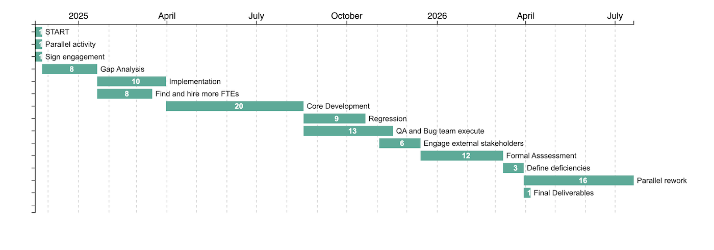

# Gantt chart, weekly

Crude node+express to make gantt charts (weekly) with [d3](https://d3js.org/).

Input is `data.csv`, see the [committed example](data.csv) for columns and format.

`npm install && npm start` and then access [localhost:3000](http://localhost:3000)

## Future features

Submit an GH Issue!  I might be looking to expand the functionality, and then deploy but for now it's a hack project.  Or dm me to collaborate.